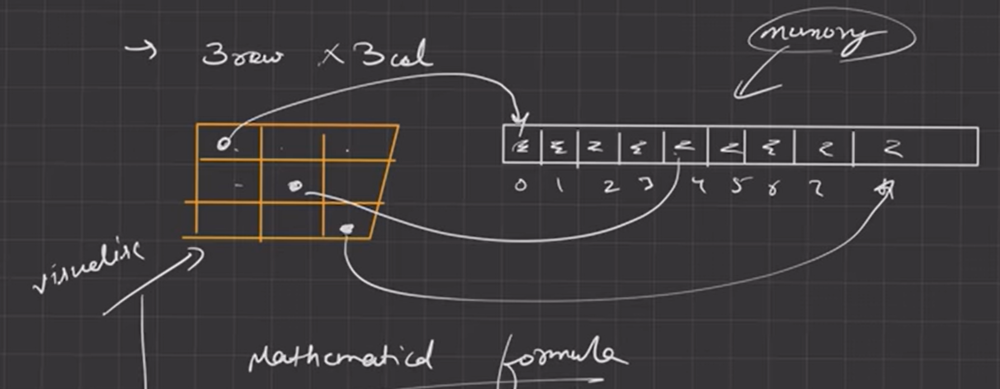
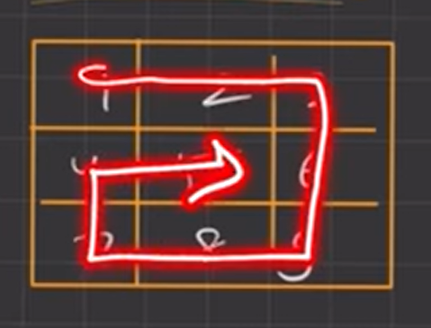

# 2D Arrays

If you want to make tic tac toe like table then you can make it using 3 arrays with each has size 3.
But if you want 1000 * 1000 Matrix then it will be difficult to make big numbers of Arrays
To solve this problem you can use linear Array. 

Ex. 3 * 3 Matrix then you can make array of size 9.


```
| 0 | 1 | 2 |
| 3 | 4 | 5 |
| 6 | 7 | 8 |
```

You can use `Total Columns(C) * Row(i) + Col(j)` to find that position.
Ex. If you want position of 1st Row and 0th Col then by formula you can get position `3 * 1 + 0 = 3`
`| 0 | 1 | 2 | `**3**` | 4 | 5 | 6 | 7 | 8 |`

Above solution is already implemented and to use this we use 2D Arrays.


## Creation of 2D Arrays
- Creation of Array `int arr[3];`
  | 0 | 1 | 2 |

- Creation of 2D Array `int arr[3][3];`
- ```
  | 0 | 1 | 2 |
  | 3 | 4 | 5 | == But in memory it's stored as ==> | 0 | 1 | 2 | 3 | 4 | 5 | 6 | 7 | 8 |
  | 6 | 7 | 8 |
  ```


## How to take input and give output?
- use `cin >> arr[row_index][col_index];` for taking input.
- use `cout << arr[row_index][col_index];` for output.


## Passing 2D array as a argument and accessing it as a parameters
- In parameters, we must need to put value of column in `int arr[][col];` otherwise it will give an error. <br>
**Read More ->** <a href="https://stackoverflow.com/questions/12813494/why-do-we-need-to-specify-the-column-size-when-passing-a-2d-array-as-a-parameter">Why do we need to specify the column size when passing a 2D array as a parameter?</a>


## Passing 2D array as a parameter
- You can pass 2D array as parameter by `int arr[rows][cols];`. But it's not recommended to use static values. Because it limits the flexibility of your code. If you hard-code the size of the array into the function, then the function can only handle arrays of that specific size.
- You can pass 2D array using Pointers or by using Vector of vector.
  1. Using **Pass a 2D array to a function using pointers and sizes**
    - In this method, when you're calling any function then you've to pass pointer of array to argument. Ex. `print2D_ArrUsingPtrAndSizes((int *)arr1, 3, 4);`.
    - `(int *)arr1` is a typecast. It’s telling the compiler to treat arr1 as a pointer to an integer. This is necessary because the function `print2D_ArrUsingPtrAndSizes `expects its first argument to be of type `int *`.
    - The reason for this typecast is that in `C++`, arrays decay into pointers when passed to functions. That means if you have an array like `int arr[10]` and you pass it to a function that takes an `int *`, the array will be treated as a pointer to its first element.
    - However, this decay doesn’t work for 2D arrays directly because a 2D array is essentially an array of arrays, and when it decays into a pointer, it becomes a pointer to an array, not a pointer to an integer. So we need to manually cast the 2D array to `int *` with `(int *)arr1`.
  
  2. Using vector of vector
    Ex. Declaring Vector: `vector<vector<int>> arr(3, vector<int>(3));`
        Function: `void print2D_ArrUsingVector(vector<vector<int>> &arr)`
    - The reason we pass arr by reference using the `&` symbol is to avoid making a copy of the 2D array. If we passed it by value (without the &), C++ would create a copy of the entire 2D array for the function to use, which could be slow and use up a lot of memory if the array is large.
    - `vector<vector<int>> arr` declares a 2D vector named arr.
    - The outer vector represents the rows of the 2D array, and the inner `vector<int>` represents the columns of each row.
    -` (3, vector<int>(3))` is a constructor that tells the vector how to initialize itself.
    - The first argument `3` tells the outer vector to create` 3` rows.
    - The second argument `vector<int>(3) `is another vector constructor. It tells the inner `vector<int>` to create 3 columns for each row and initialize all elements to zero.
    - `vector<vector<int>> arr(3, vector<int>(3));` creates a `3x3` 2D vector where all elements are initialized to zero. It’s equivalent to the `int arr[3][3] = {0};`
    
    **Note:** When you declare a vector without specifying its size, it’s initially empty, which means it has no elements and its size is 0. If you try to access an element in an empty vector using the `[]` operator, you’re trying to access memory that hasn’t been allocated, which leads to undefined behavior.
    If you want to do it with same way `vector<vector<int>> arr;` then you've to use `resize()` function. See Example on `1_Intro.cpp` file.

  
  ## Problems:
  1. **Spiral Print:**
```
| 0 | 1 | 2 |
| 3 | 4 | 5 |
| 6 | 7 | 8 |
```



 2. **Transpose of Matrix:**
-  Transpose of a matrix is obtained by interchanging all rows to columns and columns to rows.
```
| 1 | 2 | 3 |                     | 1 | 4 | 7 |
| 4 | 5 | 6 |  ==> Transpose ==>  | 2 | 5 | 8 |
| 7 | 8 | 9 |                     | 3 | 6 | 9 |
```

