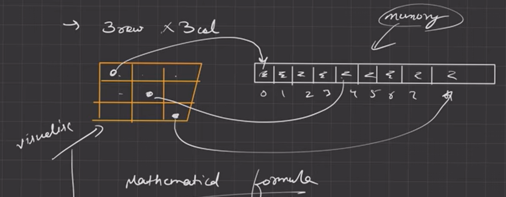

# 2D Arrays

If you want to make tic tac toe like table then you can make it using 3 arrays with each has size 3.
But if you want 1000 * 1000 Matrix then it will be difficult to make big numbers of Arrays
To solve this problem you can use linear Array. 

Ex. 3 * 3 Matrix then you can make array of size 9.


```
| 0 | 1 | 2 |
| **3** | 4 | 5 |
| 6 | 7 | 8 |
```

You can use `Total Columns(C) * Row(i) + Col(j)` to find that position.
Ex. If you want position of 1st Row and 0th Col then by formula you can get position `3 * 1 + 0 = 3`
`| 0 | 1 | 2 | `**3**` | 4 | 5 | 6 | 7 | 8 |`

Above solution is already implemented and to use this we use 2D Arrays.


## Creation of 2D Arrays
- Creation of Array `int arr[3];`
  | 0 | 1 | 2 |

- Creation of 2D Array `int arr[3][3];`
  | 0 | 1 | 2 |
  | 3 | 4 | 5 | == But in memory it's stored as ==> | 0 | 1 | 2 | 3 | 4 | 5 | 6 | 7 | 8 |
  | 6 | 7 | 8 |


## How to take input and give output?
use `cin >> arr[row_index][col_index];` for taking input.
use `cout << arr[row_index][col_index];` for output.


## Passing 2D array as a argument and accessing it as a parameters
In parameters, we must need to put value of column in `int arr[][col];` otherwise it will give an error.
Read More -> <a href="https://stackoverflow.com/questions/12813494/why-do-we-need-to-specify-the-column-size-when-passing-a-2d-array-as-a-parameter">Why do we need to specify the column size when passing a 2D array as a parameter?</a>

