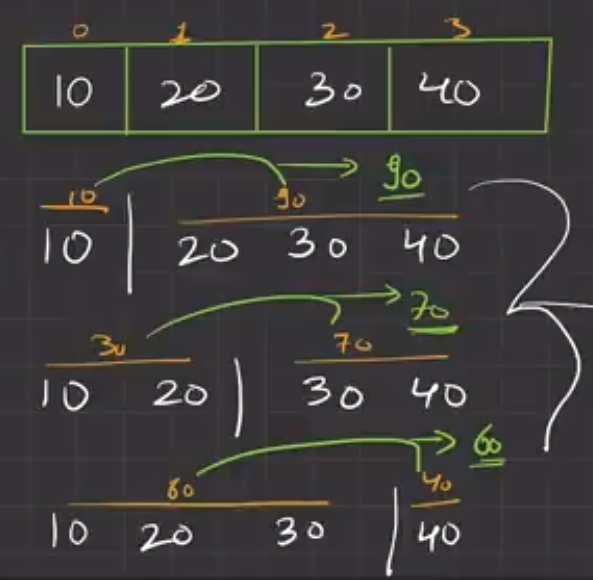

# Arrays

An array is a collection of items of same data type stored at contiguous memory locations.

## Why?
To store multiple values in one variable.
Example: 
```
10000 values ---> 10000 variables
10000 values ---> 1 variable
```

## Declaring Arrays

`int arr[10];`
Here 'arr' is the name of array as well as it's locates address of 1st element of array.

If you declared array without initializing it then it will contain garbage values.
`int arr[10];`

- Arrays are contiguous memory locations.
- Indexing start with 0. `arr[0]` is the first location.
  ```
  arr[1] ==> 100 + 4 * 1    // Here 1 is the 2nd memory location and assume 100 as memory location. 4 is the size of int
  ```
- `int arr[10000] = {0}` Here all array elements is initialized with 0.
  `int arr[10000] = {1}` But here this will not work. It only works for 0.

- **Note: Bad Practice**
Always initialize array with some value not by input value
Why? -----> See Pointer topic for detailed explaination.
```
int size;
cin >> size;

int arr[size]; // 💀⚠️
```


## Scopes in Array
- When an array is passed as a parameter to a function, it is not passed as a full copy of the array. Instead, the base address of the array is passed as a pointer, for example: `void updateArr(int *arr, int size)`.
- This means that any changes made to the elements of the array within the function will modify the original array.
- As a result, it is important to be cautious when modifying array elements within a function, as these changes will persist even after the function returns.


## Inplace Algorithms:
- Inplace means don't take extra space/memory
- The input is usually overwritten by the output as the algorithm executes. An in-place algorithm updates its input sequence only through replacement or swapping of elements.
- In other words, an in-place algorithm operates directly on the input data structure without requiring extra space proportional to the input size. It modifies the input in place, without creating a separate copy of the data structure. This can be useful when working with large data sets, as it can help reduce memory usage and improve performance.
- Examples: Sorting algorithms, Reversing an array ...


## **Find Duplicates in an Array**:
1. **XOR method**: 
  - This method is only works if the array contains elements from 1 to n and there is exactly one duplicate element. If these conditions are not met, this approach will not work.
  - Time Complexity is O(N) and Space complexity is O(1)
  - **Explaination**:  The idea is to XOR all the elements in the array and then XOR the result with all numbers from 1 to n. Since XOR is both commutative and associative, the order in which we perform the XORs does not matter. Also, since a XOR a = 0 for any number a, all the elements in the array except for the duplicate element will cancel out. The final result will be the duplicate element.

2. **Unordered Map**:
  - The unordered_map::count() is a builtin method in C++ which is used to count the number of elements present in an unordered_map with a given key.
  - Note: As unordered_map does not allow to store elements with duplicate keys, so the count() function basically checks if there exists an element in the unordered_map with a given key or not.
  - This function returns 1 if there exists a value in the map with the given key, otherwise it returns 0.
  - Refer this artical on <a href="https://www.geeksforgeeks.org/unordered_map-count-in-c/">GeekForGeeks -> Unordered_Map</a>


## **Binary Search**:
Binary search is only applicable on Monotonic functions. A monotonic function is a mathematical concept that refers to a function that follows a particular order.
Don't use **`(st + en) / 2`** to find middle element.
Explaination:
  - Maximum value of int is `2<sup>31</sup>-1`
  - If `st = 2<sup>31</sup>-1` and `en = 2<sup>31</sup>-1`, then addition of `st` and `en` is not in range of `int`.
  - Therefore, use **`st + (en - st) / 2`**


### 1. **Peak Index in Mountain:** 
  - `[7, 9, 1, 2, 3]` In this array `7, 9` are can be describe as `arr[i] < arr[i + 1]` means each element is smaller than next element & `1, 2, 3` can be describe as `arr[i] > arr[i + 1]` means each element is greater than next element.
  - In this array peak element `arr[i - 1] < arr[i] > arr[i + 1] ` is `9` .


### 2. **Find Pivot in an Array:**
- **Rotated Sorted Array:** A rotated sorted array is an array that was originally sorted in ascending order, but has been rotated by some number of positions. For example, if we have a sorted array `[1, 2, 3, 4, 5]` and rotate it by two positions to the right, we get the rotated sorted array `[4, 5, 1, 2, 3]`.

- **Pivot element:** In a rotated sorted array, the pivot element is the only element that is smaller than its previous element. It is the point at which the array was rotated. For example, if we have a sorted array `[1, 2, 3, 4, 5]` and rotate it by two positions to the right, we get the rotated sorted array `[4, 5, 1, 2, 3]`. In this case, the pivot element is `1`, as it is the only element that is smaller than its previous element `(5)`.


### 3. More Precision of Square Root
- The function takes three arguments: num, precision, and tempSoln.
- It returns a more precise approximation of the square root of num.
- factor controls the precision of the approximation.
    On the first iteration, factor is set to 1 / 10 = 0.1.
    On the second iteration, factor is set to 0.1 / 10 = 0.01.
    And so on…
- ans is the initial approximation of the square root of num.
- The outer loop iterates precision times to increase precision.
- The inner loop increments ans by factor until the square of ans is greater than or equal - to num.
    - For example, if num = 4, tempSoln = 1, and precision = 1, then:
    - On the first iteration, ans is incremented by 0.1 until it reaches a value greater    than - or equal to 2.
    - The final value of ans is approximately 2, which is a more precise approximation of     the - square root of 4.
- The final value of ans is returned as the result.


### 4. Book Allocation
You've to allocate the book to m students such that **the maximum number of pages assigned to a student is minimum.**

Example: <br>

<br>
Here our answer is 60 because it's minimum.


## Rotate an Array

If you `%` any number with `n`, then your answer/output will always come in range of `0 .... (n - 1)`.
Example: `num % 10` ---> answer will be in range of `(0 ... 9)`
          43 % 10 = 3, 69 % 10 = 9
        
Shift ith term in cyclic way using following formula -
**Formula:** - **`arr[(i + k) % n] = arr[i]`** ... where, i = index, k = rotate by num, n = size of array 


## Pascal Triangle

In this solution, when you're accessing previous rows elements to take sum and add to current position. 

```
temp[j] = ans[i - 1][j - 1] + ans[i - 1][j];
```
Here, temp is a current row and `temp[j]` is current position. To add value in it we need to calculate sum of previous row's `j`th position and `j - 1`th position.
`ans` is the main vector which stores a vector. So we're going to previous vector by `ans[i - 1]` and access particular position by `ans[i - 1][j]` jth element.