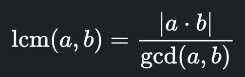

# Maths for DSA

## **Sieve of Eratosthenes**
- The Sieve of Eratosthenes is an ancient algorithm used to find all prime numbers up to any given limit
- in `/count_primes.cpp`(brute force approach) code we're calculating each number from `2` to `num` to determine is it prime or not. So time complexity is `O(n^n)`.

- *Sieve of Eratostehnes approach for count_primes problem*
    1. Mark each number as a prime number
    2. Mark non-prime to the numbers which are in table of current selected number except selected number.

**Explaination by Striver:**
If a problem provides a  10<sup>6</sup> number of testcases and each number is very close to or equal to a 10<sup>6</sup>.
Then the worst-case scenario becomes, 
```
O(T*sqrt(n)) = O(10^6, sqrt(10^6))
             = 10^6 * 10^3
             = equivalent to 10^9 operations
```
If we assumed 10^8 as 1 second/ 2 second at max then this is going to take 10 seconds and it will give you TLE(time limit exceeded) error. Therefore we've to use Sieve of Erastothenes algorithm.

**Note:** If you define `int` array in main function or any other function then maximum limit is `10^6` and for `bool` it's `10^7`.
But if you define `int` array globally then it's max limit is `10^7` and for `bool` it's `10^8`


**Sieve of Eratosthenes** VS **Segmented Sieve**
**Sieve of Eratosthenes**:
- This algorithm creates a list of all integers from 2 to `n`.
- It iteratively marks the multiples of each number starting from 2.
- The numbers that are not marked in the end are the primes.
- The time complexity is **O(n log log n)**.
- The space complexity is **O(n)**, which can be a problem for large `n` as it may not fit in memory.
- when n is large, the Simple Sieve faces the following issues.
    - An array of size Θ(n) may not fit in memory
    - The simple Sieve is not cached friendly even for slightly bigger n. The algorithm traverses the array without locality of reference

## **Segmented Sieve**:
- This algorithm overcomes the space complexity issue of the Sieve of Eratosthenes.
- If we've input `n` very large (say 10<sup>9</sup> or higher) then normal sieve will try to create an array of size `n + 1`. And many programming language environment may not allow to create this big size of array. It's very inefficient, consuming too much memory.
- It divides the range `[0..n-1]` into different segments and computes primes in all segments one by one.
- It first uses the Sieve of Eratosthenes to find primes smaller than or equal to `√(n)`.
- For every segment, it creates an array `mark[high-low+1]` and marks multiples of primes in this range.
- The time complexity remains **O(n log log n)**.
- The space complexity reduces to **O(√n)**, making it more efficient for large `n`.

So, while both algorithms are used for finding prime numbers, the Segmented Sieve is more efficient when dealing with large numbers due to its lower space complexity.


## Euclid's Algortithm
1. **GCD/ HCF:**
- GCD - Greatest common divisor

- It's a one factor which is maximum and can divide both the numbers perfectly and give remainder 0. The GCD of two numbers is the largest number that divides both of them without leaving a remainder.
Example:


- Formula: `gcd(a, b) = gcd(a - b, b) => gcd(a % b, b)`
- Learn more about Euclid's Algorithm at: <a href="https://www.codingninjas.com/studio/library/gcd-euclidean-algorithm">codingninjas.com</a>

2. Efficient Approach: **Binary GCD algorithm or Stein’s algorithm**.
- Initialize a variable shift to count the number of common factors of 2 in `num1` and `num2`
- `((num1 | num2) & 1) == 0` This is a bitwise operation that checks if both numbers are even. Here’s how it works:
    - The `|` operator performs a bitwise `OR` operation. If either of the bits is `1`, the result is `1`. Otherwise, it’s `0`.
    - The `&` operator performs a bitwise `AND` operation. If both bits are `1`, the result is `1`. Otherwise, it’s `0`.
    - In binary, the least significant bit (LSB) of an even number is always `0`. So, `(num1 | num2) & 1` checks the LSB of the result of the bitwise `OR` operation between `num1` and `num2`. If the result is `0`, it means both numbers are even.
- If `num1` is even, divide it by 2 until it becomes odd. Same for `num2` in do-while loop
- Finally, we return the GCD by shifting left num1 by shift bits (i.e., multiplying it by 4).

- **Why we don't use normal operators and used bitwise operators?**
    - The reason we use bitwise operators in the Binary GCD algorithm is because bitwise operations are generally faster than arithmetic operations. Here’s why:

    - Division and modulus operations (/ and %): These operations are relatively slow because they involve multiple steps of subtraction and shifting.

    - Bitwise operations (>>, <<, &, |): These operations are very fast because they directly manipulate the bits of the numbers, and each operation can be done in a single step.

    - In your code, you’re using division by 2 (num1 /= 2; num2 /= 2;) and modulus by 2 (num1 % 2 == 0) to check if a number is even and to halve it. These can be replaced with right shift (num1 >>= 1; num2 >>= 1;) and bitwise AND with 1 (num1 & 1 == 0), respectively, to make the code faster.

    - Also, in your return statement, you’re multiplying num1 by 4 (return num1 * 4;). This can be replaced with left shift by 2 (return num1 << shift;) to multiply num1 by the number of common factors of 2 in the original numbers.

    - So, while your code is correct, using bitwise operators can make it more efficient.

## LCM (Least common multiple)
- It is a method to find the smallest common multiple between any two or more numbers.

- Formula: <br>
    

- LCM(a, b) * GCD(a, b) = a * b


## Modular Arithmatics
- Modular arithmetic is a type of arithmetic that deals with numbers that are divided by a certain number, called the modulus. Modular arithmetic involves numbers “wrapping around” upon reaching a certain value, known as the modulus.
- It’s like a clock: when you add 4 hours to 11 o’clock, you get 3 o’clock, not 15 o’clock. This is because clocks “wrap around” every 12 hours
- The modulus is usually a prime number, but it can be any number.
- In modular arithmetic, we only care about the remainder of a division operation, not the quotient.
- Modular arithmetic is useful for a variety of reasons, including simplifying calculations and solving competitive programming problems.
-  The result of the expression `n mod m` is known as n's residue modulo m.
- In programming, modular arithmetic is often used for several reasons:
    - To keep numbers within a certain range: If you’re working with an array of size n, you might use the modulus operator to ensure that an index stays within the range 0 to n-1.
    - To prevent overflow: When dealing with large numbers, you can use the modulus operator to prevent the number from exceeding the maximum limit of the data type.
    - To cycle through values: If you want to cycle through a set of values, you can use the modulus operator. For example, in graphics programming, colors might be represented as integers from 0 to 255. If you want to cycle through these colors, you could use the modulus operator.
    - In hash functions: The modulus operator is often used in hash functions to distribute values evenly across an array.

- Answer of `a % n` is always between `0` & `(n - 1)` included.
    `a % n ===> [0 -----> (n - 1)]`

- Learn more about Modulo Operator on: <a href="https://codeforces.com/blog/entry/72527">codeforces.com</a>

- Some important identities about the modulo operator
    - `(a + b) % m = (a % m) + (b % m) % m`
    - `(a - b) % m = (a % m) - (b % m) % m`
    - `(a * b) % m = (a % m) * (b % m) % m`

- That's a great question! In modular arithmetic, it's true that different numbers can have the same remainder when divided by the modulus. For example, if the modulus is 12, then 15 and 3 both have a remainder of 3. 

- However, in many applications of modular arithmetic, this "wrapping around" behavior is exactly what we want. For example, when working with hours on a clock, we don't care about the difference between 3 AM and 3 PM - we just care that they're both "3 hours past the hour". 

- In other cases, we might use modular arithmetic to keep numbers within a certain range to prevent overflow, even though this means that different numbers might map to the same result.

- If we need to differentiate between numbers that have the same remainder when divided by the modulus, then we would need to use a different technique. For example, we might choose a larger modulus, or use a different system altogether.

- In summary, while modular arithmetic does mean that different numbers can map to the same result, this is often a useful property and not a problem. When it is a problem, there are other techniques we can use.

## Fast Exponentiation
- To reduce time complexity of brute force apporoach to find solution of problem `a^b` we use this.
```
        |--> (a^(b/2))^2 -----------> If b is even
a^b ----|
        |--> [(a^(b/2))^2] * a -----> If b is odd
```


## Pigeonhole Principle
- The principle states that if you have more items (pigeons) than containers (pigeonholes), then at least one container must contain more than one item. For example, if you have 10 pigeons and 9 pigeonholes, then at least one pigeonhole must contain more than one pigeon.
- Example: Given that the population of London is greater than the maximum number of hairs that can be present on a human’s head, then the pigeonhole principle requires that there must be at least two people in London who have the same number of hairs on their heads.


## Inclusive Exclusive Principle
- **Principle**: The Inclusion-Exclusion Principle is a combinatorial way to compute the size of a set or the probability of complex events². It relates the sizes of individual sets with their union².

- **Statement**: To compute the size of a union of multiple sets, it is necessary to sum the sizes of these sets separately, and then subtract the sizes of all pairwise intersections of the sets, then add back the size of the intersections of triples of the sets, subtract the size of quadruples of the sets, and so on, up to the intersection of all sets².

- **Example 1**: How many binary strings of length 8 either start with a ‘1’ bit or end with two bits ’00’?¹
    - If the string starts with one, there are 7 characters left which can be filled in 2^7 = 128 ways.
    - If the string ends with ’00’ then 6 characters can be filled in 2^6 = 64 ways.
    - Strings that start with ‘1’ and end with ’00’ have five characters that can be filled in 2^5 =32 ways.
    - So by the inclusion-exclusion principle we get- Total strings = 128 + 64 – 32 = 160¹

- **Example 2**: How many numbers between 1 and 1000, including both, are divisible by 3 or 4?¹
    - Number of numbers divisible by 3 = floor(1000/3) = 333.
    - Number of numbers divisible by 4 = floor(1000/4) = 250.
    - Number of numbers divisible by both (i.e., divisible by their LCM which is 12) = floor(1000/12) = 83.
    - Therefore, number of numbers divisible by either 3 or 4 = 333 + 250 – 83 = 500¹
