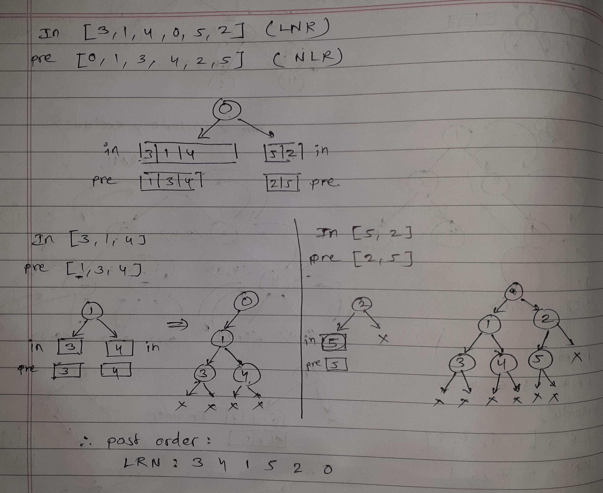

# Binary Trees

1. boundary traversal approach
    

    here, red part is leaf nodes
    orange is left part and yellow is right part (reverse order)

2. vertical order traversal
    

3. lowest common ancestor
    
    here, 5 is the lowest common ancestor of node 8 and node 27.

4. k sum paths
    

5. build tree from inorder and preorder
    